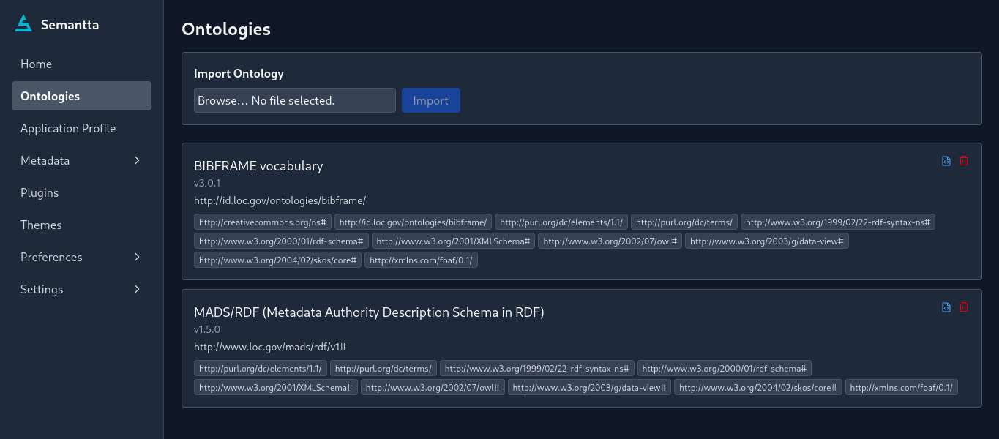
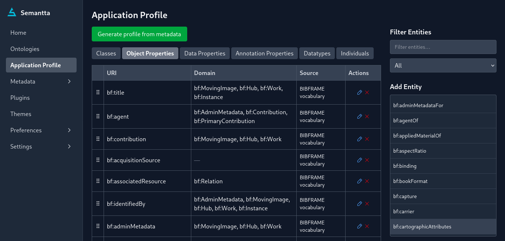
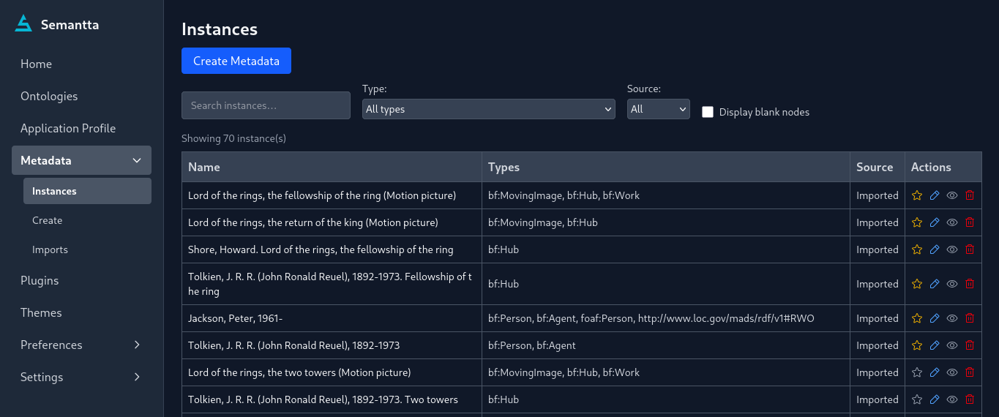
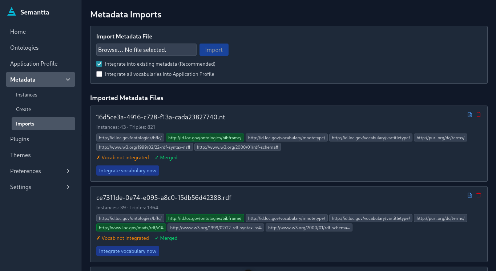
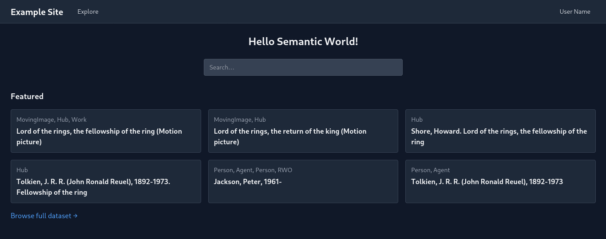
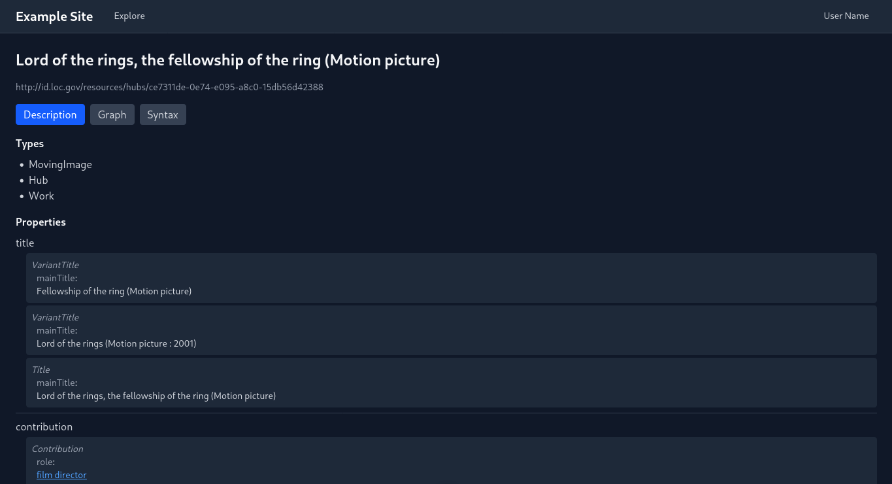
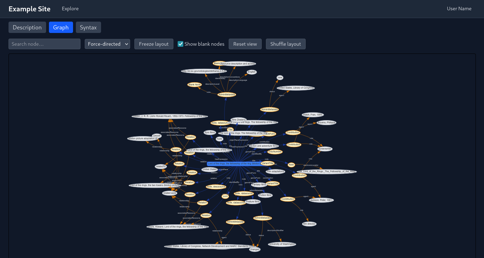

# Semantta

A web‑based, RDF‑native platform for managing linked data based on OWL/RDF ontologies.
## Architecture

Semantta is built around a three‑layer architecture:  
1. **Ontology Layer**: Provides capability to import semantics that represent knowledge about a domain, including concepts in the domian and relationships among them.  
2. **Application Profile (AP) Layer**: Provides capability to tailor the semantics from the *Ontology Layer* to the needs of a specific application.  
3. **Metadata Layer**: Provides capability to apply the tailored semantics from the *AP Layer* to real data.

## Features

- Import OWL/RDF ontologies and metadata in standard RDF formats (RDF/XML, Turtle, N‑Triples, JSON‑LD, …)
- Build a SHACL‑based, ontology‑aware Application Profile (AP)
- Create, import, edit, delete, and validate linked data against the AP and ontologies
- Generate a profile automatically from existing metadata
- Explore the dataset publicly with label‑first display and an interactive graph
- Switch between dark, light, and system theme modes
- Extend the system with plugins and themes
- Progressive Web App (PWA)

Semantta is domain‑independent and can host data from any domain.

## Used Technologies

| Layer | Technology |
| --- | --- |
| Data | RDF, RDFS, OWL, SHACL, XSD, SPARQL |
| Backend | FastAPI, rdflib, owlrl, pyshacl, httpx |
| Frontend  | Nuxt 4 (Vue 3, TypeScript), Pinia, Tailwind CSS 4, SortableJS, vis‑network, Phosphor Icons, vue‑sonner |

## Installation

Download the latest packaged version from the [GitHub Releases](https://github.com/eaoui/semantta/releases) page.

Semantta currently provides:

* Linux x64 — AppImage and Debian package
* Windows x64 — NSIS installer
* macOS arm64 — DMG and ZIP
* macOS x64 — DMG and ZIP

The packaged application is self-contained and does not require users to separately install Python, Node.js, Java, or Fuseki.

See the detailed [installation guide](docs/INSTALLATION.md) for installation instructions and package verification.

## Development

See the detailed [development guide](docs/development/DEVELOPMENT.md) for development setup and instructions.

## Basic Workflow

1. **Import an ontology**: Upload an RDF/XML, Turtle, or other supported format via the admin interface. The system applies OWL‑RL reasoning and caches the result.
2. **Build the Application Profile**: Open the “Application Profile” page, activate the entities you need, and fine‑tune the SHACL constraints.
3. **Create or import metadata**: Create instances manually via the dynamic form, or upload RDF-based metadata files. Instances are validated against the AP.
4. **Explore publicly**: You can search or browser the existing dataset. The `/dataset` page indexes all instances. Click any instance to see its
description, syntax, and interactive graph.

## Contributing

Contributions are welcome! Please open an issue to discuss your idea before submitting a pull request.

## License

Semantta is free software: you can redistribute it and/or modify it under the terms of the GNU General Public License as published by the Free Software Foundation, either version 3 of the License, or (at your option) any later version.

This program is distributed in the hope that it will be useful, but WITHOUT ANY WARRANTY; without even the implied warranty of MERCHANTABILITY or FITNESS FOR A PARTICULAR PURPOSE. See the [GNU General Public License](LICENSE) for more details.

## Applications

Have you built a public project on top of Semantta? Add it below!  

- [Example Application Name](https://example.app)

# Screenshots

## Admin

## Public

View all screenshots in [docs/screenshots](docs/screenshots/)
